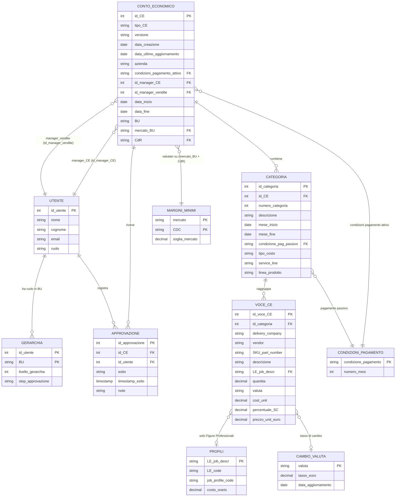

```mermaid
erDiagram

    CONTO_ECONOMICO {
        int id_CE PK
        string tipo_CE
        string versione
        date data_creazione
        date data_ultimo_aggiornamento
        string azienda
        string condizioni_pagamento_attivo FK
        int id_manager_CE FK
        int id_manager_vendite FK
        date data_inizio
        date data_fine
        string BU
        string mercato_BU FK
        string CdR FK
    }

    UTENTE {
        int id_utente PK
        string nome
        string cognome
        string email
        string ruolo
    }

    GERARCHIA {
        int id_utente PK
        string BU PK
        int livello_gerarchia
        string step_approvazione
    }

    APPROVAZIONE {
        int id_approvazione PK
        int id_CE FK
        int id_utente FK
        string esito
        timestamp timestamp_esito
        string note
    }

    CATEGORIA {
        int id_categoria PK
        int id_CE FK
        int numero_categoria
        string descrizione
        date mese_inizio
        date mese_fine
        string condizione_pag_passivo FK
        string tipo_costo
        string service_line
        string linea_prodotto
    }

    VOCE_CE {
        int id_voce_CE PK
        int id_categoria FK
        string delivery_company
        string vendor
        string SKU_part_number
        string descrizione
        string LE_job_descr FK
        decimal quantita
        string valuta
        decimal cost_unit
        decimal percentuale_SC
        decimal prezzo_unit_euro
    }

    PROFILI {
        string LE_job_descr PK
        string LE_code
        string job_profile_code
        decimal costo_orario
    }

    MARGINI_MINIMI {
        string mercato PK
        string CDC PK
        decimal soglia_mercato
    }

    CONDIZIONI_PAGAMENTO {
        string condizione_pagamento PK
        int numero_mesi
    }

    CAMBIO_VALUTA {
        string valuta PK
        decimal tasso_euro
        date data_aggiornamento
    }

    CONTO_ECONOMICO }o--|| UTENTE              : "manager_CE (id_manager_CE)"
    CONTO_ECONOMICO }o--|| UTENTE              : "manager_vendite (id_manager_vendite)"
    CONTO_ECONOMICO ||--o{ CATEGORIA           : "contiene"
    CONTO_ECONOMICO ||--o{ APPROVAZIONE        : "riceve"
    CONTO_ECONOMICO }o--|| CONDIZIONI_PAGAMENTO : "condizioni pagamento attivo"
    CONTO_ECONOMICO }o--|| MARGINI_MINIMI      : "valutato su (mercato_BU + CdR)"
    UTENTE          ||--o{ GERARCHIA           : "ha ruolo in BU"
    UTENTE          ||--o{ APPROVAZIONE        : "registra"
    CATEGORIA       ||--o{ VOCE_CE             : "raggruppa"
    CATEGORIA       }o--|| CONDIZIONI_PAGAMENTO : "pagamento passivo"
    VOCE_CE         }o--o| PROFILI             : "solo Figure Professionali"
    VOCE_CE         }o--o| CAMBIO_VALUTA       : "tasso di cambio"
```
